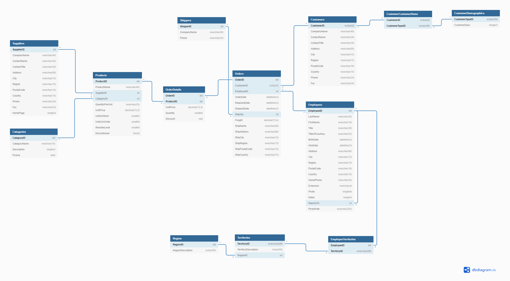

# Prueba Técnica Backend Node.js

Hola! 👋 Nos alegra que hayas llegado hasta este punto y puedas llegar a ser parte del gran equipo humano de Serempre.

## Entregables

- Repositorio GIT con código fuente
- Scripts sql para la creación de la Base datos, creación de las tablas e insertado de datos

## Extras

- Documentación del API Swagger, ReDoc o Postman
- Implementar contenedores con Docker
- Desplegar en un servidor web Azure App Service, AWS, Google Cloud, Heroku o Netlify etc.
- Pruebas Unitarias
- Uso de TypeScript
- Utilizar una solución con ORM (Object-relational mapping)
- Uso de algún framework de tu conocimiento (Nest, Sails, Adonis)

## Desarrollo de la prueba

### Base de datos

1. Crear la siguiente estructura de base datos en SQL a partir de siguiente diagrama:

2. usar SQL Server (Recomendada), MySQL, PostgreSQL o Oracle DB para la base de datos.

3. Importa los datos de las tablas usando los CVS (opcional).

### Servicio web

Realizar un Web API en Node.js express, debe tener los siguientes recursos disponibles:

| Recurso   	| Endpoint            	| Entradas                                          	| Descripción 	| Respuesta 	|
|-----------	|---------------------	|---------------------------------------------------	|-------------	|-----------	|
| Productos 	| api/products        	| QueryParams : (pagina, cantidad items por pagina) 	|             	|           	|
| Productos 	| api/products/:id    	| Params : (id de producto)                         	|             	|           	|
| Productos 	| api/products/search 	| QueryParams                                       	|             	|           	|
|           	|                     	|                                                   	|             	|           	|
|           	|                     	|                                                   	|             	|           	|

## A tener en cuenta

- Código Limpio
- Excelentes prácticas
- Implementación de arquitectura escalable
- Uso de códigos de estado respuesta HTTP
- Uso de métodos para peticiones HTTP
- Validación de datos
- Manejo de errores
- El uso de patrones de diseño SOLID, KISS DRY, MVC etc.
- Documentación de código

## Recomendaciones

- IDE para administrar bases de datos [DataGrip](https://www.jetbrains.com/datagrip/)

## Para enviar tu solución

Incluye un README.md que incluya la documentación acerca del proyecto, que hable de las cosas interesantes con las que te enfrentaste, decisiones que tomaste, etc. Cuando termines, crea un repositorio publico en GitHub que solo contenga tu proyecto.